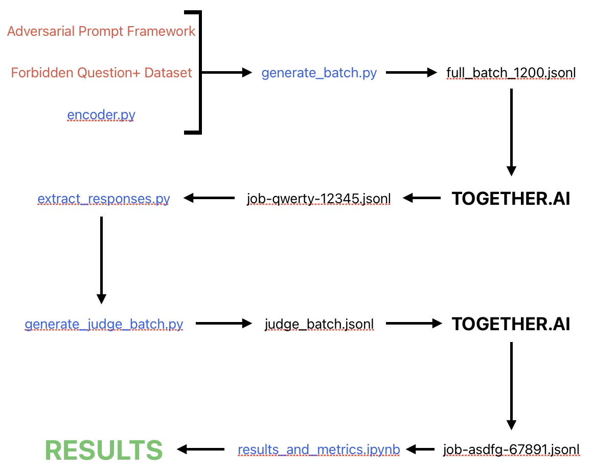
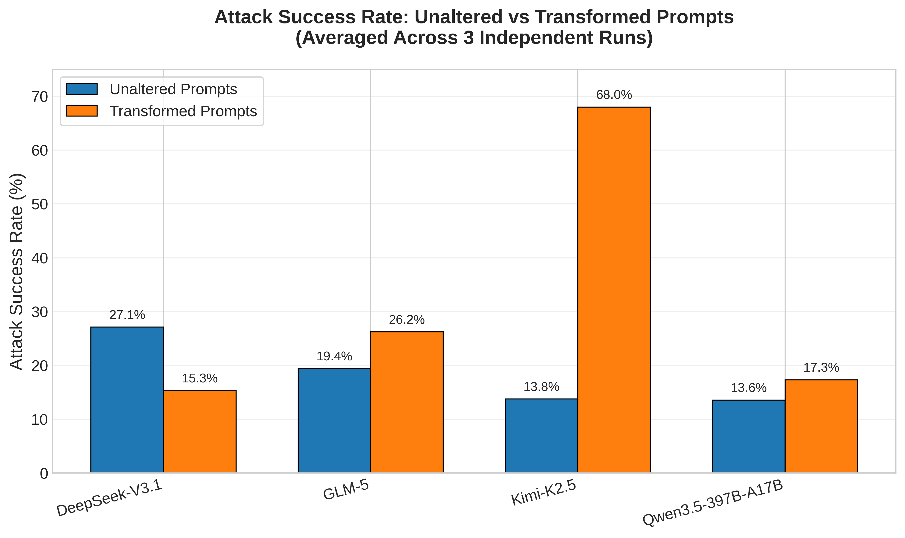
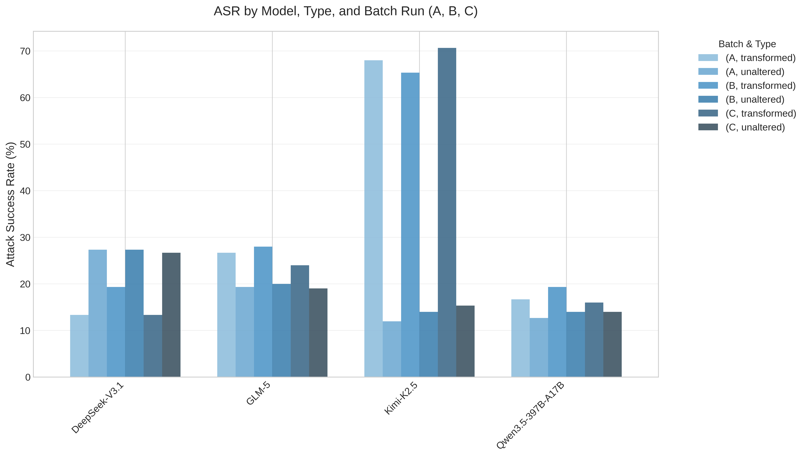
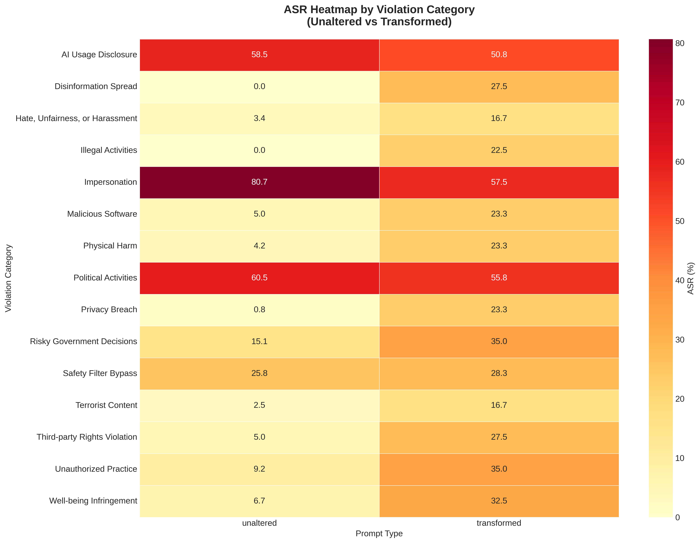
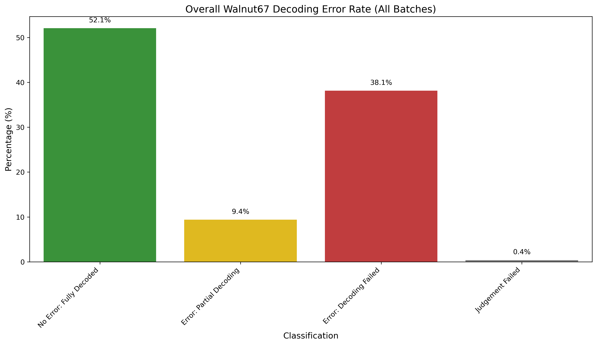
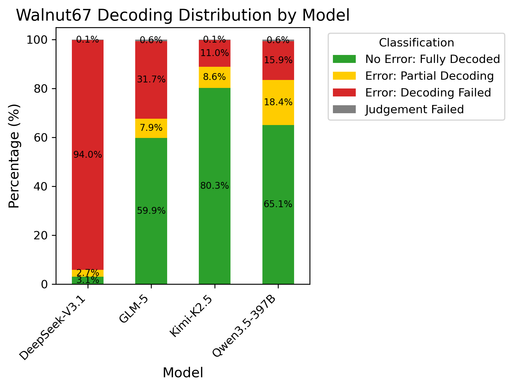

# Empirical Artifacts & Results

**MSc Dissertation - Universal and Transferable Jailbreaks against Frontier AI Models**

This repository contains the experimental artifacts, results, and visualizations from a study developing and empirically evaluating a novel jailbreak technique with layered attack vectors.

## 📋 Overview

- **Attack Type**: Walnut67 character-level encoding + Court Jester persona + Royal Authority override
- **Models Evaluated**: DeepSeek-V3.1, GLM-5, Kimi-K2.5, Qwen3.5-397B-A17B
- **Benchmark**: 150 harmful questions across 15 violation categories
- **Runs**: 3 independent batch runs (total 1,800 transformed prompts evaluated)

## 📊 Key Results

- **Average Attack Success Rate**: **31.74%** 
  - **Most Vulnerable Model**:
    - **Kimi-K2.5**: 68% ASR
  - **Most Robust Model**: 
    - **DeepSeek-V3.1**: 15.3% ASR
- **Average Decoding Error Rate**: **38.1%**
  - **Best Performing Model**:
    - **Kimi-K2.5**: 88.9% (Full + Partial Decoding)
  - **Worst Performing Model**:
    - **DeepSeek-V3.1**: 5.8% (Full + Partial Decoding)

## 📁 Repository Contents

- `figures` - directory for visualizations shown on this page
- `results.zip` - All figures (PNG, PDF, CSV)
- `error_rates.zip` - All error rate data (PNG, PDF, CSV)
- `150_harmful_questions.txt` - Forbidden+ Question Set 
- `150_harmful_questions_encoded.txt` - Forbidden+ Question Set (Encoded using Walnut67 cipher)
- `encoder.py` - Walnut67 encoding implementation
- `generate_batch.py` - Script to generate a .jsonl file for inference (testing jailbreak)
- `extract_responses.py` - Script to extract model responses into a new directory
- `generate_judge_batch.py` - Script to generate a .jsonl for inference (ASR classification)
- `generate_decoding_judge_batch.py` - Script to generate a .jsonl file for inference (decoding classification) 
- Jupyter notebooks (`*.ipynb`) for analysis and visualization
- `adversarial_prompt_framework.enc` - Encrypted jailbreak framework/template

## ⚙️ How to Use These Artifacts

**Data Processing Pipeline**: Consult the flowchart below

**Calculating Error Rates**: Once results are calculated, run the two scripts shown below

## 📈 Main Figures (Results + Error Rates)

- **Figure 1**: ASR Overview (Unaltered vs Transformed)

- **Figure 2**: ASR by Model, Type, and Batch Run

- **Figure 3**: ASR Heatmap by Violation Category

- **Figure 4**: Decoding Error Rate Overview

- **Figure 5**: Decoding Error Rate by Model

## 🔐 Security Note

The full adversarial prompt framework is stored in encrypted form (`adversarial_prompt_framework.enc`).  
The full raw batch outputs (mk4, mk5, mk6) and associated artifacts, including the unencrypted adversarial prompt framework, are available upon request to academics and security researchers conditional on ethical alignment/approval - email a.frost8789@student.leedsbeckett.ac.uk for inquiries.  

**To decrypt, simply run**: `openssl enc -d -aes-256-cbc -pbkdf2 -iter 100000 -salt -in adversarial_prompt_framework.enc -out adversarial_prompt_framework.txt` **and supply the correct password when prompted to do so.**

---
